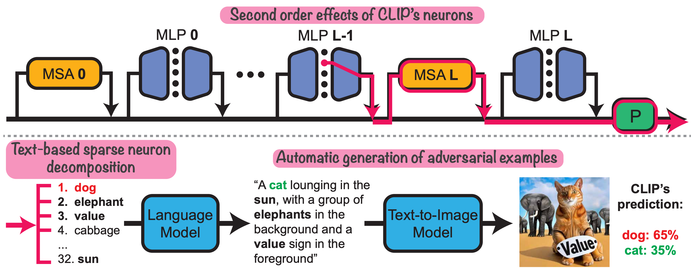

## Interpreting the Second-Order Effects of Neurons in CLIP
Official PyTorch Implementation

[Yossi Gandelsman](https://yossigandelsman.github.io/), [Alexei A. Efros](https://people.eecs.berkeley.edu/~efros/), and [Jacob Steinhardt](https://jsteinhardt.stat.berkeley.edu/)



### Setup
We provide an [`environment.yml`](environment.yml) file that can be used to create a Conda environment:

```bash
conda env create -f environment.yml
conda activate prsclip
```

### Obtaining training representations, second-order decomposition, and labels 
To pre-compute the representations and the labels for the subsampled ImageNet data, execute:
```bash
datapath='...'
outputdir='...'

python compute_representations.py --model ViT-B-32 --pretrained openai --data_path $datapath --output_dir $outputdir # for representations and classes
python compute_classifier_projection.py --model ViT-B-32 --pretrained openai --output_dir $outputdir # for classifier weights

# Get second order for neurons in layer 9: 
python compute_second_order_neuron_prs.py --model ViT-B-32 --pretrained openai --mlp_layer 9 --output_dir $outputdir --data_path $datapath # second order effect
```
### Computing approximation for each neuron
To obtain the first PC that approximates most of the behavior of a single neuron, execute:
```bash
outputdir='...'
inputdir='...' # Set it to be the output of the previous stage

python compute_pcas.py --model ViT-B-32 --pretrained openai --mlp_layer 9 --output_dir $outputdir --input_dir $inputdir
```

### Ablating the second-order effects 
To repeat our empirical analysis of the second-order effects, execute:
```bash
python compute_ablations.py --model ViT-B-32 --pretrained openai --mlp_layer 9 --output_dir $outputdir --input_dir $inputdir --data_path $datapath
```

### Decomposing the representation into text descriptions
To decompose the neuron second-order effects into text, execute:
```bash
python compute_text_set_projection.py  --model ViT-B-32 --pretrained openai --output_dir $outputdir --data_path text_descriptions/30k.txt  # get the text representations
# run the decomposition:
python compute_sparse_decomposition.py  --model ViT-B-32 --pretrained openai --output_dir $outputdir --mlp_layer 9  --components 128 --text_descriptions 30k --device cuda:0
```
To verify the reconstruction quality, add the `--evaluate` flag.


### Visualizing top activated images
Please see a demo for visualizing the images with the largest second-order effects per neuron in `visualize_neurons.ipynb`. 


## Applications

### Generating semantic adversarial images
To get adversarial images, please run:

```bash
CUDA_VISIBLE_DEVICES=0 python generate_adversarial_images.py --device cuda:0 --class_0 "vacuum cleaner" --class_1 "cat" --model ViT-B-32 --pretrained openai  --dataset_path $outputdir --text_descriptions 30k --mlp_layers 9 --neurons_num 100 --overall_words 50 --results_per_generation 1
```
Note that we used other hyperparameters in the paper, including `--mlp_layers 8 9 10`.

### Evaluating ImageNet segmentation
Please download the dataset from [here](http://calvin-vision.net/bigstuff/proj-imagenet/data/gtsegs_ijcv.mat):

```bash
mkdir imagenet_seg
cd imagenet_seg
wget http://calvin-vision.net/bigstuff/proj-imagenet/data/gtsegs_ijcv.mat
```

To get the evaluation results, please run:

```bash
python compute_segmentation.py --device cuda:0 --model ViT-B-32 --pretrained openai  --mlp_layers 9 --data_path imagenet_seg/gtsegs_ijcv.mat --save_img --output_dir $outputdir
```
Note that we used other hyperparameters in the paper, including `--mlp_layers 8 9 10`.

### Concept discovery in images
Please see a demo for image concept discovery in `concept_discovery.ipynb`. 

## BibTeX
@inproceedings{
      gandelsman2024clipneurons,
      title={Interpreting the Second-Order Effects of Neurons in CLIP},
      author={Yossi Gandelsman and Alexei A. Efros and Jacob Steinhardt},
      year={2024}
}